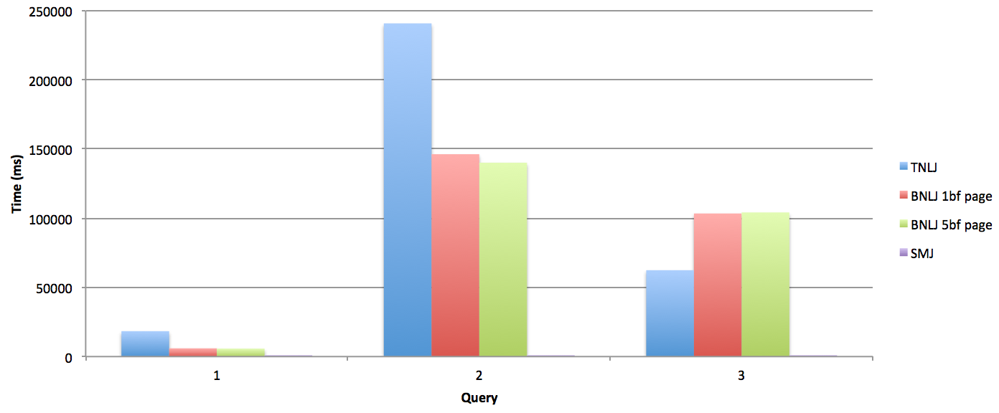

# Benchmarking testing for TNLJ, BNLJ, SMJ

## Test Plan:
**Precondition:**  
	1.Only three tables: Sailors, Reserves, and Boats 
	   
**Queries:**
		1. SELECT * FROM Sailors, Reserves WHERE Sailors.A = Reserves.G;  
		2.SELECT * FROM Sailors, Reserves, Boats WHERE Sailors.A = Reserves.G AND Reserves.H = Boats.D;  
		3. SELECT * FROM Sailors, Reserves, Boats WHERE Sailors.A = Reserves.G AND Reserves.H = Boats.D AND Sailors.B < 150;

## large samples
1. Table Name: Sailors, Reserves, Boats     
2. Schema: Sailors.A, Sailors.B, Sailors.C/ Boats.D,Boats.E,Boats.F,Reserves G,Reserves F  
3. Number of buffer used for the SMJ: 1 buffer page or 5 buffer page  
 
### Case 0: Benchmarking data 
	Boats:		Tuples: 5000	Range: 500	
	Sailor: 	Tuples: 6000 	Range: 600
	Reserves:   Tuples: 6000 	Range: 700
**Result** Pass  

#### Observation
Based on the graph, we can see sortmerge join greatly reduce the execution time. Block nested loop join is able to reduce the execution time when the join condition comtains multiple equal condition. We also found the time comsumption for BNLJ with 1 buffer page and 5 bffer page are very close. The reseaon is that saving the outer relation in buffer pages reduces total passes of inner relation. However, if the block size exceeds the memory capacity, extra disk I/Os are needed to fetch different portions of the block. Thus there is a compromise between maximizing outer block size and minimizaing inner page passes. 

### Case 1: large range 
	Boats:		Tuples: 5000	Range: 1000	
	Sailor: 	Tuples: 6000 	Range: 2000
	Reserves:   Tuples: 2000 	Range: 500
 **Time Consumption: see excel file**  
**Result:** Pass 
### Case 2: small range
	Boats:		Tuples: 5000	Range: 100  
	Sailor: 	Tuples: 6000 	Range: 200
	Reserves:   Tuples: 2000 	Range: 300  
**Time Consumption: see excel file**  
**Result:** Pass

