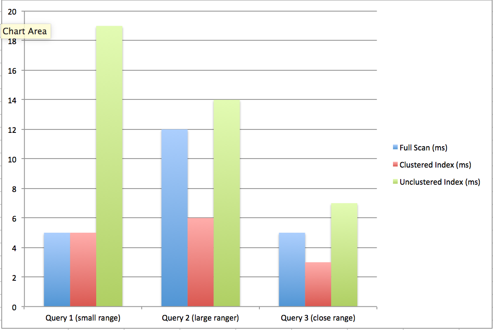
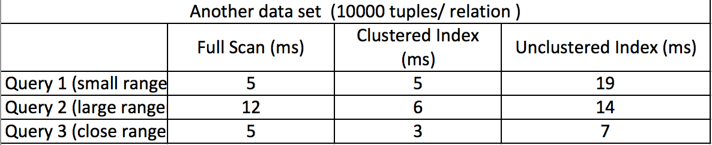
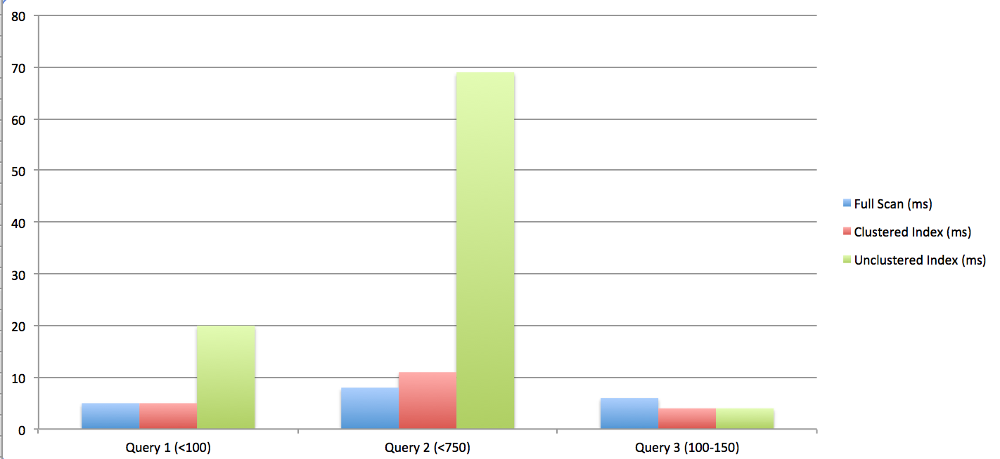
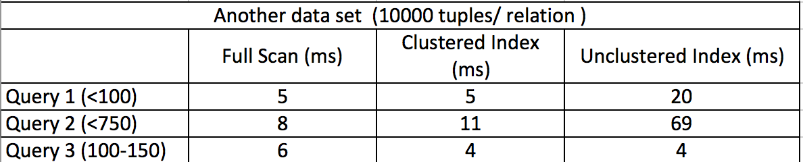

# Benchmarking tests for index scan operator

## Test Plan:
We would use three queries showing below to compare the execution time among full scan, unclustered index scan and clustered index scan. 

**Queries:**  
	**Test Case1:**
	  
1. SELECT * FROM Boats WHERE Boats.E < 100;   
2. SELECT  * FROM Boats WHERE Boats.E < 150;  
3. SELECT * FROM Sailors WHERE Sailors.A  > 100 and Sailors.A <150;  

	**Test Case 2:**
1. SELECT * FROM Boats WHERE Boats.E < 100;   
2. SELECT  * FROM Boats WHERE Boats.E < 750;  
3. SELECT * FROM Sailors WHERE Sailors.A  > 100 and Sailors.A <150;  
**Note**
Query 1 tests the small range selection performance. Query 2 tests the large range selection performance. Query 3 tests a range selection with both low key and high key. 

**Test Description:**  
For each query, we first use full scan operation to output the result, and record the execution time. Then we test the same query using the index file we build on the unclustered file to output the result, and record the execution time.  Lastly, we test the same query using the index file we build on the clustered file to output the result, and record the execution time.

After we record all the data, we compare the execution times for different scan methods using a bar diagram.  

## Relation Description:
Table Boats contains 5000 tuples ranging from 0 - 500
Table Sailors contains 5000 tuples raning from 0 - 500
 
**Schema:**  
Boats: D E F, index on E  
Sailors: A B C, index on A 

## Results: 
**Comparison between full scan, clustered index, and unclustered index scan:**  
**Test Case 1**

**Test Case 2**  

**Observation:**  
From the table and image shown above, we can see for our test cases, unclusted index did improve the execution time, however, the unclustered index scan is the slowerest. The reason for that is because, it took additional IOs for unclustered index to fetch tuple. For each tuple, it took one IO to fetch. Additonally, we can see from table 2, that unclustered execution time is greatly affected by a large range selection. 

 
